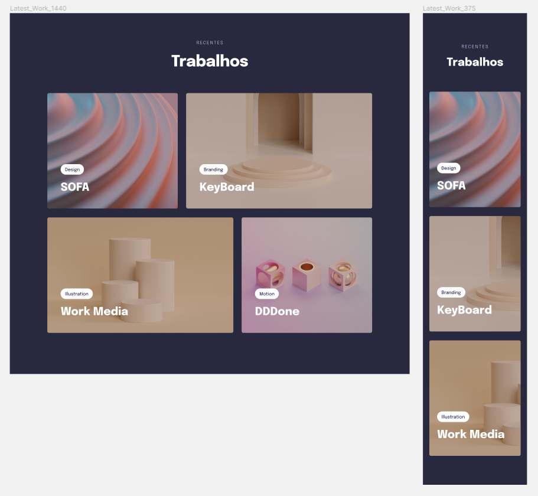

# 💻 Projeto: Recentes Trabalhos

 

## 📌 Sobre o Projeto

Projeto desenvolvido no programa Explorer da Rocketseat.
Assuntos importantes aplicados: 

  * CSS grid
  * Transições e Transformações
  * Animações com CSS
  * Ajuste de textos com CSS clamp 

Figma: https://www.figma.com/file/qfv7A3T0y65gR7WrDY2oCM/Explorer-Stage-03-Projeto-03-(Copy)?node-id=203%3A1865

 

## 📌 Tecnologias 

Esse projeto foi desenvolvido com as seguintes tecnologias:

* HTML
* CSS

 

## 📝 Licença

Esse projeto está sob a licença MIT. Veja o arquivo [LICENSE](LICENSE) para mais detalhes.

 
 

<h4 align="center">
    Por Rodrigo de Morais 🚀
</h4>